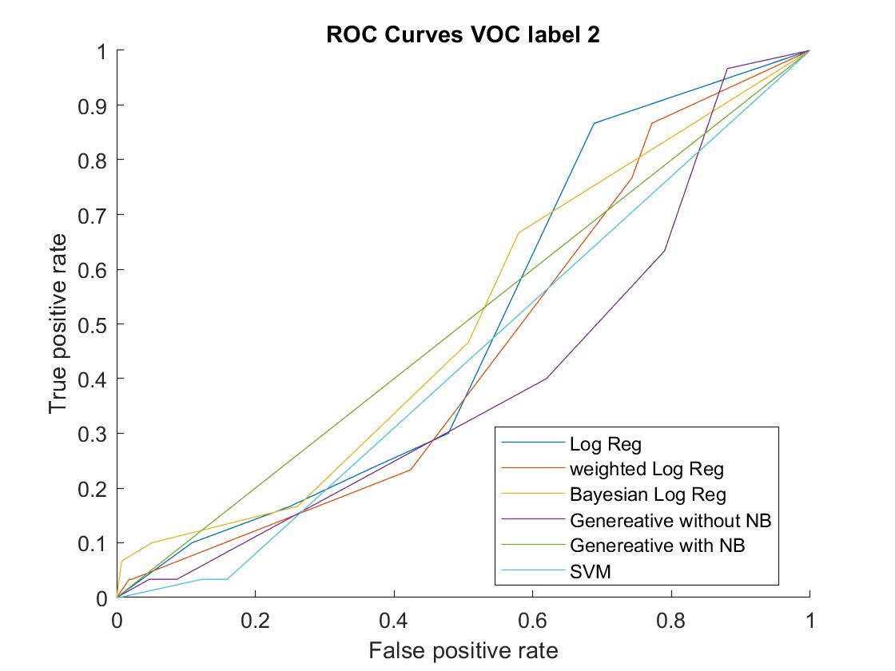

# Multi-class Classification
In this repository implementation of some multiclass classification algorithms have been provided. Some of these algorithms have been designed for muti class inputs and
some uses one-vs-rest(all) strategy. Below you can find the list of the algorithms implemented.

* multinomial Logistic Regression
* Weighted Logistic Regression
* Bayesian Logistic Regression (Two classes using one-vs-rest)
* Gaussian Generative classification
* Gaussian Naive Bayes Classification

## How to run
1- add measure function folder (if you cant wait for *is not found in the current folder* error and click on *add its folder to the MATLAB path*)

2- read the features and labels into **fts** and **labels** variables;

3- Use any of the ML algorithms just like the way used in **main.m**

4- run **main.m**

## Results
Three datasets, PIE, VOC, MSRC was used for evaluating the code. Below you can find the result of each algorithm using *5-folding*.

**1- PIE Dataset**

Algo/measure           | Precision | Recall | F1 
---------------------- | --------- | ------ | -----
Logistic Regression    | 0.963     | 0.962  | 0.96
Weighted Log Reg	   | 0.72      | 0.7    | 0.71
Bayesian Log Reg       | 0.95      | 0.93   | 0.93
Gaussian Generative    | 0.971     | 0.967  | 0.969
Generative Naive Bayes | 0.96      | 0.95   | 0.95

**2- MSRC Dataset**

Algo/measure           | Precision | Recall | F1 
---------------------- | --------- | ------ | -----
Logistic Regression    | 0.78      | 0.78   | 0.78
Weighted Log Reg	   | 0.18      | 0.18   | 0.18
Bayesian Log Reg       | 0.64      | 0.67   | 0.65
Gaussian Generative    | 0.79      | 0.74   | 0.76
Generative Naive Bayes | 0.89      | 0.19   | 0.31

**3- VOC Dataset**

Algo/measure           | Precision | Recall | F1 
---------------------- | --------- | ------ | -----
Logistic Regression    | 0.43      | 0.37   | 0.40
Weighted Log Reg	   | 0.17      | 0.18   | 0.17
Bayesian Log Reg       | 0.34      | 0.34   | 0.34
Gaussian Generative    | 0.45      | 0.38   | 0.41
Generative Naive Bayes | 0.86      | 0.2    | 0.29

The ROC plot for these algorithms has been provided below.

## sources
Altought many sources online and offline has been used, Pattern Recognition and Machine Learning by Bishop (Springer) has been the most significant.
